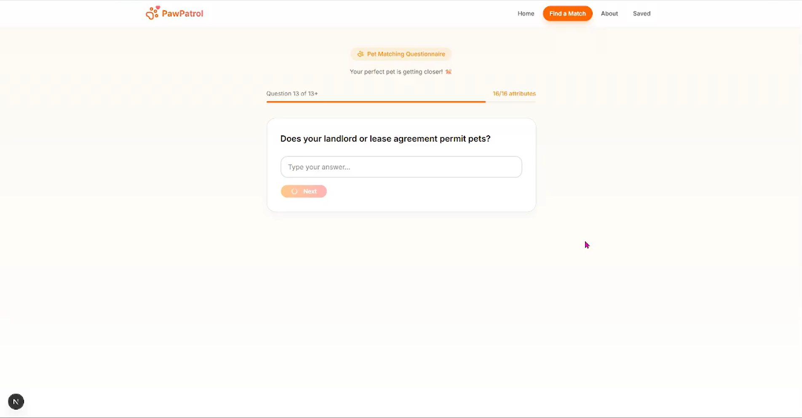
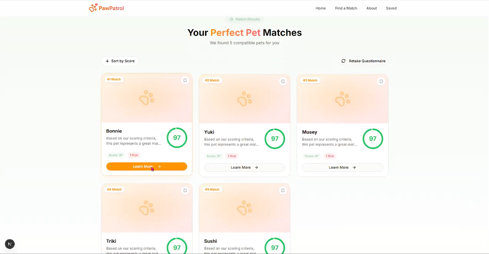
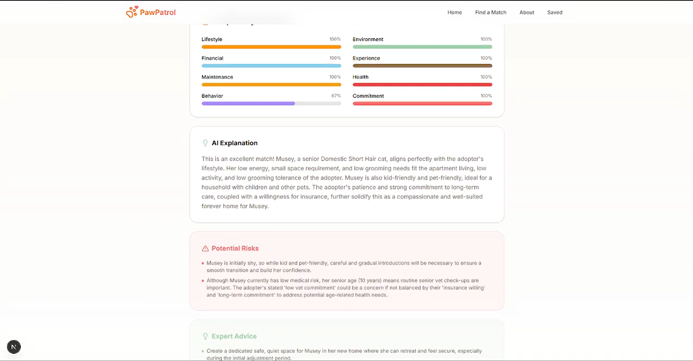

# PawPatrol: AI-Powered Pet Adoption Matchmaker

> An explainable AI system that helps shelters place the **right pet in the right home** using deterministic compatibility scoring and LLM-powered reasoning.


---

# Why PawPatrol Matters

Every year, thousands of pet adoptions fail because adopters and pets are **poorly matched**.

Traditional adoption platforms rely on **manual filtering and subjective judgment**.

PawPatrol introduces an **AI-assisted adoption matching system** that:

* reduces failed adoptions
* improves pet welfare
* supports shelters with explainable insights
* helps adopters understand *why* a pet fits their lifestyle

By combining **deterministic compatibility scoring** with **LLM-generated reasoning**, PawPatrol delivers both **accuracy and transparency**.

---

# 🎥 Demo

▶️ **Watch the full product demo**

[DEMO VIDEO](https://youtu.be/0lQgpsTWUTc?si=JDcYgTGt2dWXweeD)

---

# 🖼️ Screenshots

### Adaptive Questionnaire



### Pet Match Results



### Compatibility Details



---

# 🚀 Core Features

### Smart Compatibility Engine

Deterministic ranking based on **8 compatibility dimensions** including:

* lifestyle compatibility
* environmental readiness
* financial commitment
* grooming requirements
* energy level matching
* family environment

This ensures **objective and repeatable match scoring**.

---

### Hard Constraint Filtering

Unsafe matches are automatically rejected.

Examples:

* high-energy pets → unsuitable for small apartments
* pets requiring calm environments → filtered for homes with toddlers

This protects **both pets and adopters**.

---

### LLM-Powered Explanations

Large Language Models generate **natural language explanations** describing:

* why a match scored highly
* potential risks
* preparation advice for adopters

This turns raw compatibility scores into **actionable guidance**.

---

### Adaptive Questionnaire

A conversational system dynamically asks **only relevant questions** based on previous answers.

Benefits:

* shorter onboarding
* better adopter profiling
* improved matching accuracy

---

### Interactive Compatibility Dashboard

A modern web interface visualizes:

* compatibility score breakdowns
* pet characteristics
* AI-generated reasoning
* adoption insights

Built with a responsive and polished UI.

---

# 💡 Key Innovation

Most adoption platforms rely on **manual search filters**.

PawPatrol introduces a **hybrid deterministic + AI reasoning architecture**.

* deterministic scoring guarantees **safety and reliability**
* LLM reasoning provides **clear human explanations**

This allows shelters to make **faster, safer, and more explainable adoption decisions**.

---

# 🧠 Technical Architecture

PawPatrol is a **full-stack AI application**.

---

## Backend (`src/api`)

Built with **FastAPI**.

Responsibilities:

* compatibility scoring
* constraint filtering
* questionnaire logic
* LLM explanation generation
* REST API endpoints

Technologies used:

* FastAPI
* Pandas
* NumPy
* Google Gemini API
* Python

---

## Frontend (`frontend/`)

Built with **Next.js 15 and React 19**.

Features:

* adaptive questionnaire flow
* compatibility visualization
* real-time API integration
* responsive UI

Technologies used:

* Next.js (App Router)
* Tailwind CSS
* Framer Motion
* Lucide React

---

# 🧠 System Architecture

```
Adopter
   ↓
Adaptive Questionnaire
   ↓
Profile Extraction
   ↓
Compatibility Engine
   ↓
Constraint Filtering
   ↓
Compatibility Scores
   ↓
LLM Reasoning
   ↓
FastAPI API Layer
   ↓
Next.js Dashboard
```

---

# 📂 Project Structure

```
paw-patrol/
│
├ frontend/                # Next.js frontend application
│
├ src/
│   ├ api/                 # FastAPI routes
│   ├ questionnaire/       # Adaptive questionnaire logic
│   ├ matcher.py           # Core compatibility matching engine
│   ├ scoring.py           # Weighted scoring logic
│   ├ scoring_matrices.py  # Compatibility matrices
│   └ llm_reasoning.py     # LLM reasoning generation
│
├ data/
│   ├ datasets/
│   │   ├ raw/
│   │   └ processed/
│   └ notebooks/           # Data preparation notebooks
│
├ documentation/           # Phase-by-phase project documentation
│
└ README.md
```

---

# 🛠️ Setup Instructions

## 1️⃣ Prerequisites

You will need:

* Python **3.10+**
* Node.js **20+**
* a **Google Gemini API key**

---

# Backend Setup

Navigate to the project root:

```bash
cd paw-patrol
```

Install dependencies:

```bash
pip install -r requirements.txt
```

---

## Environment Variables

Copy the example environment file:

```bash
cp .env.example .env
```

Then fill in your API key.

Example:

```
GEMINI_API_KEY=your_gemini_api_key
```

---

Run the backend server:

```bash
python -m uvicorn src.api.main:app --reload --port 8000
```

Backend runs at:

```
http://localhost:8000
```

API docs available at:

```
http://localhost:8000/docs
```

---

# Frontend Setup

Navigate to the frontend directory:

```bash
cd frontend
```

Install dependencies:

```bash
npm install
```

Create `.env.local` if needed:

```
NEXT_PUBLIC_API_URL=http://127.0.0.1:8000
```

Run the development server:

```bash
npm run dev
```

Frontend runs at:

```
http://localhost:3000
```

---

# 📖 Phase-by-Phase Development

The project was built in **eight structured phases**.

Detailed documentation is available in the `documentation/` directory.

1. **Phase 1 — Pet Dataset Preparation**
   Cleaned and enriched a dataset of 14,000+ pets with compatibility traits.

2. **Phase 2 — Adopter Dataset Preparation**
   Created a synthetic dataset to test the matching engine.

3. **Phase 3 — Compatibility Scoring Engine**
   Implemented deterministic matching across 8 dimensions.

4. **Phase 4 — LLM-Based Reasoning**
   Integrated Gemini to explain compatibility scores.

5. **Phase 5 — Adaptive Questionnaire**
   Built a conversational profiling system.

6. **Phase 6 — API Layer**
   Wrapped the engine in a FastAPI backend.

7. **Phase 7 — Dashboard API**
   Designed endpoints optimized for UI visualizations.

8. **Phase 8 — Frontend Application**
   Developed the full Next.js adoption platform.

---

# 🔮 Future Improvements

PawPatrol currently functions as a **working prototype**.

Future improvements include:

### Deterministic Constraint Enhancements

Move from categorical traits to exact variables:

* monthly pet care budget
* home square footage
* veterinary cost estimates

---

### Machine Learning Optimization

Train models on **historical adoption outcomes** to refine compatibility scoring.

Example signals:

* adoption returns
* long-term pet health outcomes
* owner satisfaction

---

### External Data Integrations

Integrate veterinary and breed databases for:

* health risk prediction
* lifetime cost estimates
* climate compatibility

---

### Shelter CRM Integration

Integrate with systems such as:

* Petfinder
* Shelterluv
* RescueGroups

Allowing PawPatrol to operate on **live shelter inventories**.

---

# 📜 License

This project is released under the **MIT License**.